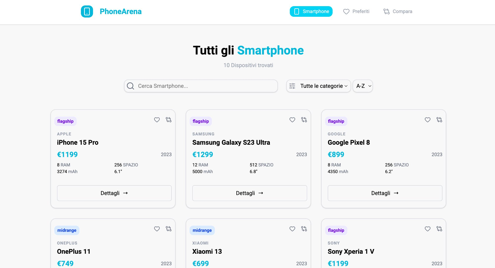
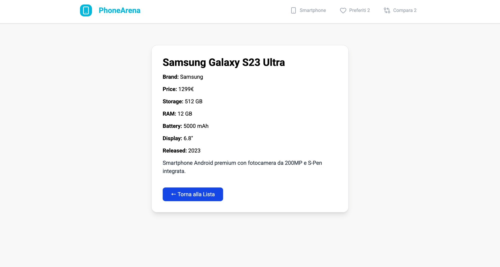
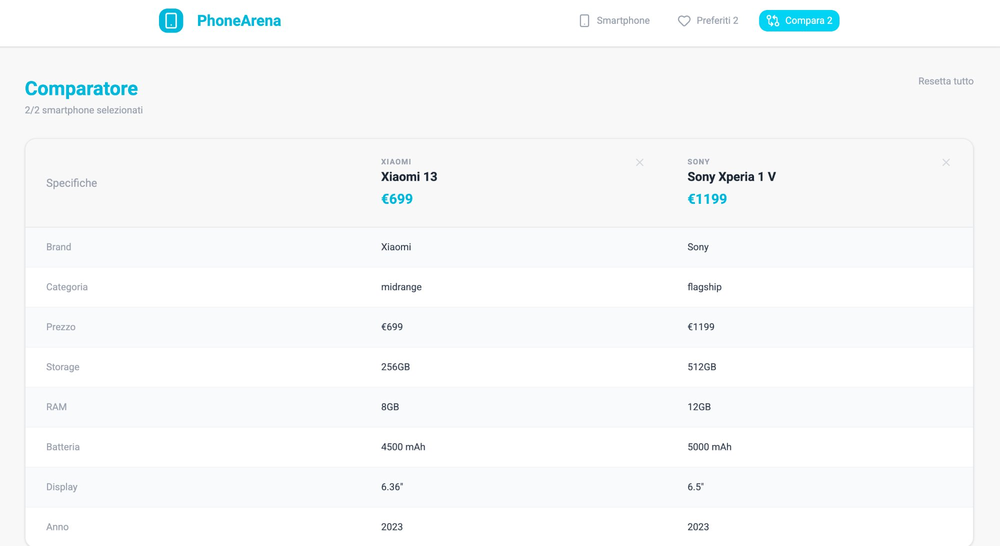
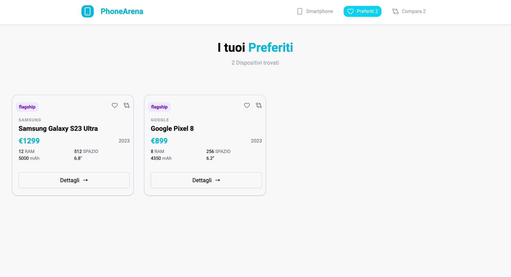

# PhoneArena 📱

Una SPA per sfogliare, cercare, filtrare e confrontare smartphone. Progetto finale del corso Spec Frontend di Boolean, sviluppato interamente in React.

---

## Screenshots









---

## Cosa fa

Puoi sfogliare una lista di smartphone, cercarli per nome, filtrarli per categoria (Flagship, Midrange, Budget) e ordinarli alfabeticamente. Ogni smartphone ha una pagina di dettaglio con tutte le specifiche.

La parte più interessante è il comparatore — puoi selezionare fino a 2 smartphone e vederli affiancati in una tabella per confrontarne le caratteristiche. C'è anche un sistema di preferiti accessibile da tutta l'app.

---

## Tecnologie usate

- **React** con React Router DOM per la navigazione
- **Tailwind CSS** per lo styling
- **Vite** come build tool
- **Lucide React** per le icone
- Backend REST già pronto fornito dal corso

---

## Come avviarlo in locale

```bash
git clone https://github.com/tuo-username/progetto-finale-spec-frontend-front
cd progetto-finale-spec-frontend-front
npm install
npm run dev
```

> ⚠️ Il progetto richiede il backend del corso per funzionare. Contattami se vuoi provarlo in locale.

---

## Struttura

```
src/
├── components/     → NavBar, SearchBar, SmartPhoneCard, Layout
├── context/        → FavoritesContext, CompareContext
├── pages/          → Lista, Dettaglio, Comparatore, Preferiti
└── App.jsx
```

---

Sviluppato da [tuo nome] — corso Spec Frontend, Boolean.
